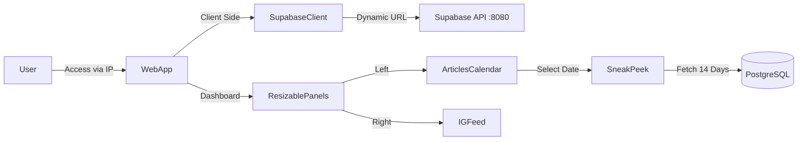

# Requirements

### Overview & Goals
The objective is to fix several UI and functional issues in the newsticker application, focusing on dashboard resizing, layout scrolling, calendar defaults, admin panel usability, and removing deprecated features.

### Scope
- **Dashboard:** Fix horizontal resizing and layout spacing.
- **Scrolling:** Resolve scroll issues on article detail and creation pages.
- **Calendar:** Set default week selection to Monday-Sunday and sync upcoming events (next 14 days).
- **Admin Panel:** Make the sidebar extended by default.
- **Cleanup:** Remove Anthias-related features and fix the Supabase API URL for remote access.

### User Stories
- **As a user**, I want to resize the dashboard panels easily so I can customize my view.
- **As a user**, I want the calendar to show the current week by default so I see relevant events immediately.
- **As an admin**, I want the sidebar to be open by default so I can navigate settings faster.
- **As a developer**, I want the Supabase client to work automatically when accessing the site via IP or hostname.

# Technical Design

### Current Implementation
- **Resizing:** Uses `react-resizable-panels` with a shadcn wrapper. The orientation CSS seems incorrectly mapped.
- **Layout:** `RootLayout` has nested `overflow-auto` without clear height constraints, breaking scrolling on some pages.
- **Calendar:** Defaults to `undefined` range. `SneakPeek` (upcoming events) is a separate component that doesn't fully react to calendar selection and lacks color coding.
- **Anthias:** Hardcoded links and logic for Anthias display manager are present in the settings and device pages.
- **Supabase Client:** Uses `process.env.NEXT_PUBLIC_SUPABASE_URL` which is often set to `localhost`, failing when accessed from other devices.

### Proposed Changes

#### 1. Resizing & Layout
- **File:** `components/ui/resizable.tsx`
    - Swap the `aria-[orientation=horizontal]` and `aria-[orientation=vertical]` classes on `ResizableHandle` to match `react-resizable-panels` behavior (where orientation refers to the group's layout).
- **File:** `app/layout.tsx`
    - Restructure the layout to use a fixed-height body with a scrollable main area.
- **File:** `components/SneakPeek.tsx`
    - Add `scrollbar-none` or refine `overflow` to prevent permanent scrollbars.

#### 2. Calendar & Upcoming Events
- **File:** `components/CalendarFilter.tsx`
    - Implement `startOfWeek` and `endOfWeek` (Monday to Sunday) for the default state.
- **File:** `components/SneakPeek.tsx`
    - Update the query to join with `calendar_subscriptions` to fetch `color`.
    - Accept `from` date from `searchParams` and calculate a 14-day window.
    - Update the UI to use the subscription color for the left border.

#### 3. Admin Panel & Sidebar
- **File:** `app/layout.tsx`
    - Modify `defaultOpen` logic to prioritize an open state if no cookie exists, or add logic to force open on `/settings/*` paths.
- **File:** `app/settings/layout.tsx`
    - Remove Anthias URL calculation and the "Display Manager" sidebar item.

#### 4. Supabase URL Fix
- **File:** `lib/supabase/client.ts`
    - Add logic to check if `NEXT_PUBLIC_SUPABASE_URL` contains `localhost` and replace it with `window.location.hostname` in browser environments.

#### 5. Spacing
- **File:** `components/CalendarFilter.tsx` & `app/page.tsx`
    - Adjust flex alignment and height to eliminate large gaps between components and the footer.

### Architecture Diagram

# Delivery Steps

### ✓ Step 1: Fix dashboard resizing logic
Fix horizontal and vertical resizing logic by correcting CSS orientation classes.
- Update `components/ui/resizable.tsx` to correctly map `aria-[orientation]` to the appropriate sizing classes (`w-px h-full` for vertical dividers in horizontal groups, and vice-versa).
- Verify that the dashboard resizing works as expected.

### ✓ Step 2: Fix layout and scrolling issues
Fix scrolling issues on article detail/edit pages and adjust general layout.
- Modify `app/layout.tsx` to ensure the main content area has a proper scrollable container.
- Update `GlobalFooter` and `GlobalHeader` placement if necessary to ensure they don't block scrolling.
- Address the "permanently visible scrollbar" in the upcoming events box (`SneakPeek.tsx`) by refining its overflow styling.
- Resolve the excessive space between the calendar and footer in `app/page.tsx` and `CalendarFilter.tsx`.

### ✓ Step 3: Update Calendar and Upcoming Events logic
Set default week selection and enhance the upcoming events feed.
- Update `CalendarFilter.tsx` to default to the current week (Monday to Sunday).
- Pass `searchParams` to `SneakPeek.tsx` in `app/page.tsx`.
- Update `SneakPeek.tsx` to display events for the 14 days following the calendar selection.
- Implement color-coding in `SneakPeek.tsx` by joining with `calendar_subscriptions`.
- Ensure recurring events are handled correctly (confirm expansion logic in `ical-parser.ts`).

### ✓ Step 4: Admin sidebar defaults
Ensure the admin sidebar is extended by default for better usability.
- Update `SidebarProvider` in `app/layout.tsx` or specifically in `app/settings/layout.tsx` to default to an open state.
- Verify that the sidebar state is persisted or correctly initialized for admin routes.

### ✓ Step 5: Anthias removal and Supabase URL fix
Remove all Anthias-specific code and handle Supabase URL dynamic resolution.
- Remove Anthias URL logic and links from `app/settings/layout.tsx` and `features/device/components/device-settings.tsx`.
- Update `lib/supabase/client.ts` to dynamically replace `localhost` with the current hostname in `NEXT_PUBLIC_SUPABASE_URL` for client-side requests.